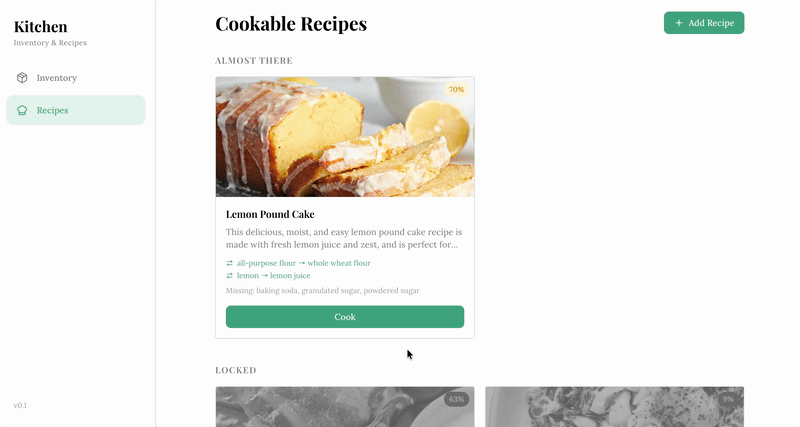
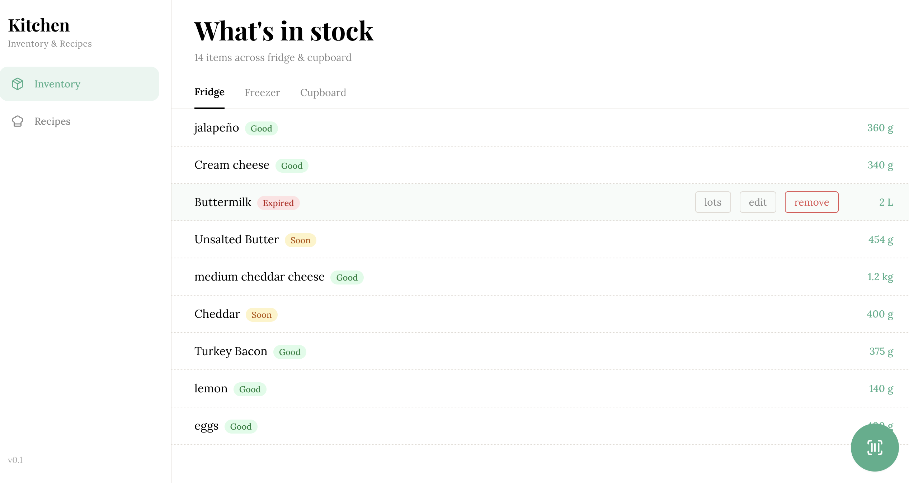
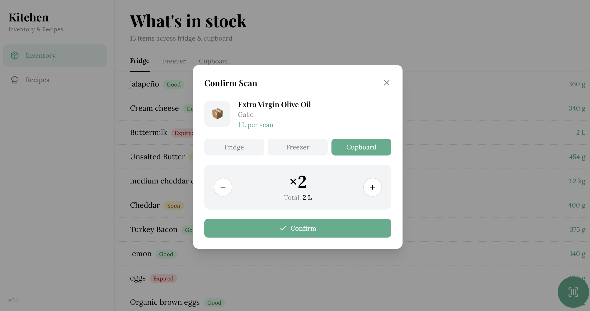
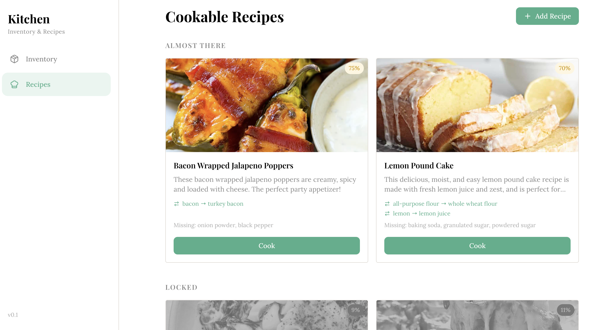
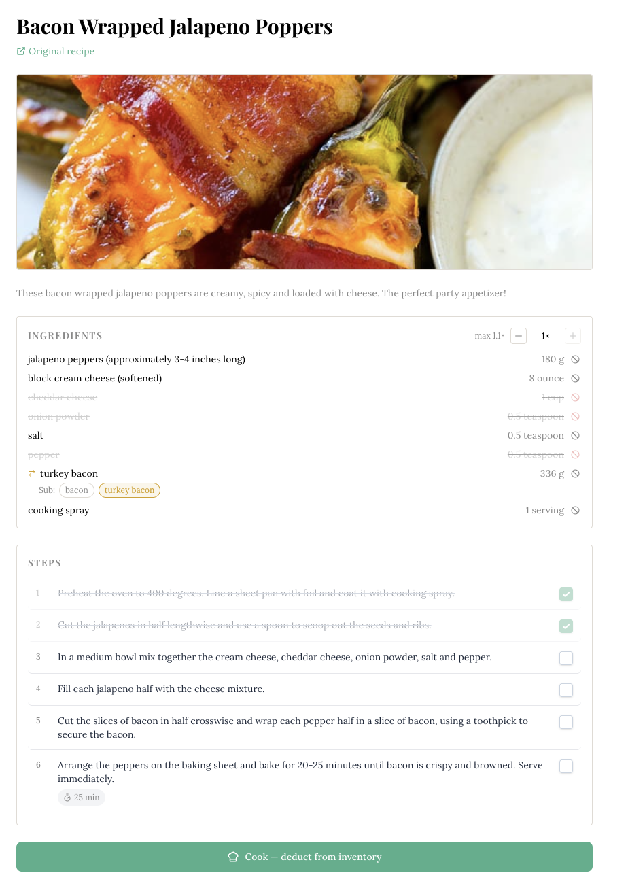

# Kitchen Inventory

A self-hosted kitchen inventory and recipe management system built for daily use on a wall-mounted tablet. Scan barcodes, photograph receipts, import recipes by URL, and always know what you can cook tonight.


---



---

## Features

**Inventory management**
- Barcode scanning via OpenFoodFacts — auto-fills name, brand, and weight
- Receipt scanning using Claude Vision API — parses line items and adds them to inventory in bulk
- FEFO (First Expired, First Out) lot tracking — items are deducted oldest-first when cooking
- Default expiry auto-population based on a configurable shelf life database
- All quantities stored in base units (grams/ml) for consistent cross-recipe matching

**Recipe system**
- Import recipes by URL via Spoonacular
- Real-time cookability matching — recipes ranked by how much of each ingredient you have
- Ingredient substitution support — knows that sour cream can substitute for Greek yogurt, etc.
- Fuzzy ingredient matching with a learned alias system (e.g. "2% milk" → "milk")
- Unit normalization — recipe quantities in cups/oz/tbsp are converted to grams for matching

**UI**
- Tablet-first touch interface, designed for a wall-mounted display
- Scan confirm modal with quantity and expiry editing before committing
- Lot details view — see individual stock entries per item with per-lot expiry dates

---

## Screenshots






---

## Architecture

```
app/
  api/v1/       REST endpoints (versioned)
  crud/         Database operations
  schemas/      Pydantic request/response models
  models/       SQLAlchemy ORM models
  services/     Business logic (shelf life, FEFO, recipe matching)
  config/       Alias seeds, substitution seeds, fresh weight tables

frontend/
  src/
    pages/      Page-level components
    components/ Modals and shared UI
    api/        Typed API client functions
    store/      Redux state (inventory + recipes)
    interfaces/ TypeScript types
```

All inventory quantities are stored in base units (grams, ml, or count). Recipe ingredients are normalised to grams where possible to enable inventory-to-recipe matching without manual unit conversion.

---

## Quick Start

### Prerequisites

- [Docker Desktop](https://www.docker.com/products/docker-desktop/) (Mac/Windows/Linux) or Docker + Docker Compose on a server/Unraid
- API keys (see below)

### 1. Configure environment

```bash
cp .env.example .env
```

Edit `.env` and fill in your keys:

| Variable | Required | Where to get it |
|---|---|---|
| `ANTHROPIC_API_KEY` | Yes — receipt scanning | [console.anthropic.com](https://console.anthropic.com) |
| `SPOONACULAR_API_KEY` | Yes — recipe import | [spoonacular.com/food-api](https://spoonacular.com/food-api) |
| `USDA_API_KEY` | Yes — ingredient weights | [fdc.nal.usda.gov](https://fdc.nal.usda.gov/api-guide.html) |
| `RECEIPTS_HOST_PATH` | No | Path on the host where receipt images are stored. Defaults to `./data/receipts` |
| `TZ` | No | Your timezone, e.g. `Europe/London`. Defaults to `America/New_York` |

### 2. Start everything

```bash
# Docker Compose v2 (Docker Desktop / most Linux installs)
docker compose up

# Docker Compose v1 (Unraid and older setups)
docker-compose up
```

On first run this will build the API and frontend containers, run database migrations, and seed ingredient data automatically.

### 3. Verify it's running

- **Frontend**: [http://localhost:3000](http://localhost:3000)
- **API docs**: [http://localhost:8000/docs](http://localhost:8000/docs)

---

## Unraid Deployment

1. Clone or copy this repo to your appdata share, e.g. `/mnt/user/appdata/kitchen-inventory`
2. Copy `.env.example` to `.env` and fill in your keys
3. Set `RECEIPTS_HOST_PATH` to a persistent path, e.g. `/mnt/user/appdata/kitchen-inventory/receipts`
4. Run as a Compose stack via the Unraid Docker Compose manager, or SSH and run `docker-compose up -d`
5. Point your tablet or display browser at `http://<unraid-ip>:3000`

Config files that persist on the host (no named volumes to hunt for):
- `.env` — credentials and paths
- `data/receipts/` (or your custom `RECEIPTS_HOST_PATH`) — receipt image archive

---

## Development

### Access the database

```bash
# Local
docker-compose exec db psql -U admin -d inventory

# Unraid (via SSH)
docker exec -it kitchen-inventory-db-1 psql -U admin -d inventory
```

### Rebuild after code changes

```bash
docker-compose down
docker-compose build --no-cache   # only needed for structural/dependency changes
docker-compose up
```

### Run tests

```bash
docker-compose -f docker-compose.test.yml run --rm test-runner
```

### API documentation

Interactive Swagger UI is available at [http://localhost:8000/docs](http://localhost:8000/docs) whenever the stack is running.

---

## License

[MIT](LICENSE)
